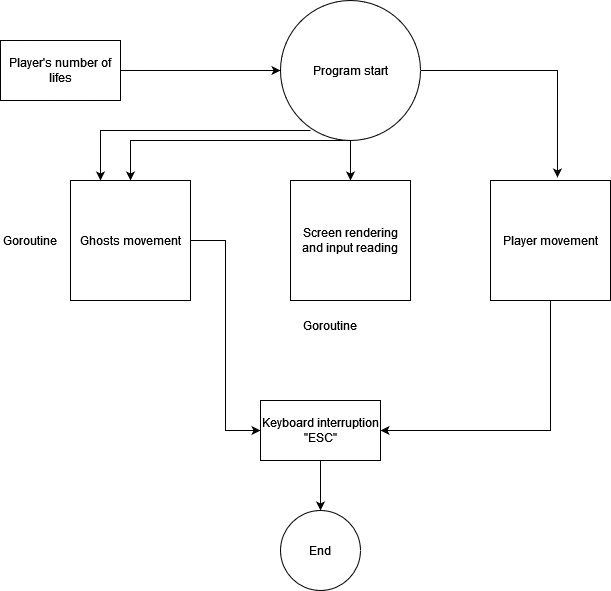

Multithreaded Pacman Game
=========================

Implement a multithreaded version of the arcade video game [Pacman](https://en.wikipedia.org/wiki/Pac-Man). This version will be a
Computer vs Human game. Each enemy will be independent and the number of enemies is configurable. Below you can see the general
requirements for the enemies and human player (pacman) interation.

Technical Requirements
----------------------
- The game's maze layout can be static.
- The `pacman` gamer must be controlled by the user.
- Enemies are autonomous entities that will move a random way.
- Enemies and pacman should respect the layout limits and walls.
- Enemies number can be configured on game's start.
- Each enemy's behaviour will be implemented as a separated thread.
- Enemies and pacman threads must use the same map or game layout data structure resource.
- Display obtained pacman's scores.
- Pacman loses when an enemy touches it.
- Pacman wins the game when it has taken all coins in the map.

Previous Requirements
=========================
- You are running macOS Catalina
- You have installed Xcode command line tools
- You have installed brew

Architecture
-------------

Multithreaded Pacman created with graphical interface and implemented in C, using the libraries SDL (SDL2 image and SDL2 ttf) and OpenMP for GUI and user input and use of threads, respectively. 

Task Flow diagram:

For the development, we took inspiration from the implementation of danicat at https://github.com/danicat/pacgo

Usage
-------------
For the movement of the player, you should use the arrow keys in your keyboard: up, down, left and right. 

Data structures
-------------

We used the following data structures:

### Sprite (for player and ghost)

| Attibutes                  |   DataType   | Description                                                                      |
|----------------------------|--------------|----------------------------------------------------------------------------------|
|     row                    |     int      | Coordinate in the X axis                                                         |
|     col                    |     int      | Coordinate in the Y axis                                                         |

### Config
| Attibutes                  |   DataType   | Description                                                                      |
|----------------------------|--------------|----------------------------------------------------------------------------------|
|     Player                 |   string     | Emoji to represent the player                                                    |
|     Ghost                  |   string     | Emoji to represent the ghost                                                     |
|     Wall                   |   string     | Emoji to represent the wall                                                      |
|     Dot                    |   string     | Emoji to represent the dot                                                       |
|     PowerUp                |   string     | Emoji to represent the powerup                                                   |
|     Death                  |   string     | Emoji to represent game over                                                     |
|     Space                  |   string     | Representation for white space                                                   |

Functions
-------------
`loadconfig():` Reads information from Json File. (Emojis and settings)

`cleanup():` Clear the console and turn of cbreak mode. 

`clearscreen()` Clears the console string in order to set a new frame.

`moveCursor(row, col int)` Moves the cursor to the given coordinates in order to print a change in the board.

`moveCursorEmoji(row, col int)` Moves the cursor to the given coordinates in order to print a change in the board considering an offset for the size of the emojis.

`readInput():` Reads from standard input and returns the direction for the movement. This is done in a goroutine. 

`loadLevel(file string)` Reads the designed level from the .txt file. 

`printScreen` Prints a new frame of the game in the console.

`movePlayer` Performs the movement of the player. If the current cell has a normal dot, the score increments 1 unit. If there is a power-up, the score increments 10 units. 

`directionGhost() string` Calculates a random number and sets the corresponding direction for the next move of the ghost. 

`moveGhost()` Moves the ghost to the corresponding direction. This is done in a goroutine. 

